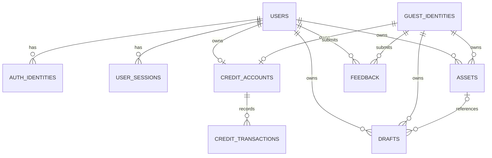

# AutoDraftman backend architecture v0.1

## Goal

Provide a production-shaped foundation for a product expected to serve at most a few thousand
users in its first public stage. The design should scale by moving standard components to managed
services, not by rewriting the application into microservices.

## Current boundary

```text
React frontend
      |
      v
FastAPI modular monolith
      |
      +-- PostgreSQL: identities, sessions, preferences, drafts, feedback, assets, credit ledger
      |
      +-- S3-compatible object storage boundary: image bytes
```

The image-generation kernel is outside this boundary. No generation request contract, mock
generator, queue, or worker is included until the kernel's runtime behavior is known.

## Decisions

### PostgreSQL only

Development, integration testing, and production use PostgreSQL. SQLite is intentionally rejected
by configuration so concurrency and migration differences cannot be hidden during development.

### Modular monolith

Identity, credits, drafts, feedback, assets, and health are separate domain modules in one
deployable service. For the expected scale this is easier to operate and test than independently
deployed services.

### Opaque server-managed sessions

Guest cookies contain a random opaque token. Only its SHA-256 hash is stored. The frontend can
explicitly start or restore a guest session through `POST /api/v1/identity/guest`. The workspace
draft routes may also establish this anonymous principal without displaying a login wall; other
protected reads do not create identities. A new guest, credit account, and initial grant ledger
entry are created atomically in one database transaction.

Google and GitHub OAuth create a `User` plus an `AuthIdentity`; one user can explicitly link
multiple providers. Matching email addresses alone never merge accounts.

### Kernel-independent drafts

Drafts contain an optional user title, text prompt, text/reference mode, aspect ratio, file format,
privacy choice, and optional reference-asset ID. They do not contain a generation status and
cannot consume credits. The browser keeps a recovery copy, while a configured API stores the
authoritative record in PostgreSQL. Guest drafts migrate atomically with assets, feedback, and
credits when the guest signs in.

### Explicit account preferences

Registered users store a default visibility for newly created drafts. It defaults to private and
never changes existing drafts retroactively. The preference is returned with the current identity
so the frontend can create a new draft consistently on every device.

### Private feedback receipts

Guests and registered users can submit product, bug, account, or general feedback. Each submission
receives a UUID reference and a visible handling status. Users can list only submissions belonging
to their current identity. Guest feedback migrates to the registered account during conversion.

### Auditable credits

`CreditAccount` keeps the current available and reserved values. Every mutation must also append a
`CreditTransaction` with post-transaction balances and an idempotency key. The future generation
flow will use:

```text
grant       (+available)
reserve     (-available, +reserved)
settle      (reserved consumed)
release     (+available, -reserved)
refund      (+available)
```

No payment or order tables exist until a payment provider and product policy are selected.

### Private asset metadata

Image bytes never enter PostgreSQL. Asset rows store an S3-compatible provider, bucket, random
object key, verified media metadata, ownership, and visibility. Permanent public URLs are not
stored. Browser uploads and private downloads use short-lived presigned URLs. After upload, the
API re-reads the object and verifies the real image type, size, dimensions, and checksum before
marking it ready.

Asset rows also record expiry, deletion, scheduled purge, and completed purge timestamps. Guest
content expires after seven days. A user deletion removes access immediately and schedules object
deletion within 24 hours. See `docs/data-retention-policy.md` at the repository root.

### Honest health reporting

`/health/live` means the process can answer HTTP. `/health/ready` additionally verifies PostgreSQL
connectivity and returns 503 when the database is unavailable.

## Tables



## Deployment evolution

### Development

- FastAPI container
- PostgreSQL container
- local MinIO using the same S3-compatible boundary as the later cloud store

### Shared internal environment

- one API container
- managed PostgreSQL with automated backups
- S3-compatible object storage
- error monitoring

### Public launch

- the same API code, optionally with a second instance
- managed PostgreSQL connection pooling
- CDN/WAF and rate limiting
- object lifecycle policies for short-lived guest data
- scheduled asset purge and account purge commands

### After the generation kernel is measured

Add one durable queue and one or more worker processes. Queue selection depends on measured task
duration, cancellation behavior, retry safety, progress reporting, and GPU placement. Redis and
Celery are not assumed in advance.

## Known limitation

Server-side guest identities make allowance grants auditable, but an anonymous user can still
clear cookies or switch devices. Before public free usage, add rate limiting and bot/risk controls;
do not describe the cookie alone as a strict one-person-one-grant mechanism.
