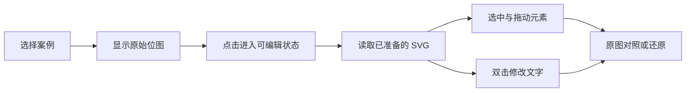

# DrawAI 公开网站学习报告

学习日期为 2026 年 10 月 3 日。本报告记录对 [DrawAI 公开网站](https://drawai.renaissancemind.ai/) 的页面、实际交互、响应式布局和已发布客户端代码的检查，并将公开研究工作台源码作为独立的架构参考。

最值得 FigFox 学习的是它证明能力的顺序：访客先操作可编辑案例，再阅读评测与研究结果。公开首页的转换演示读取预先生成的 SVG，没有在本次操作中调用在线生成服务。网站、研究工作台和生成系统需要分别理解。

## 学习范围与证据

本次实际打开了公开网站，逐段滚动查看全部内容，操作两套画布案例、元素拖动、文字修改、还原、缩放、原图覆盖对照、指标钻取、图像比较滑块、图表悬停、图例切换和指标展开。查看了 1440 × 1000 桌面及 390 × 844 手机尺寸下的中英文页面，并读取浏览器实际加载的公开 JavaScript、CSS 和指标 iframe 文件。

同时检查了 [官方公开仓库](https://github.com/Renaissance-Mind/DrawAI) 的工作台前后端源码。源码快照为 `7d853dccb1e77271e8296855e601ea5e9177369c`。这些检查说明代码怎样组织，不证明该工作台已经在公开网站部署，也不证明生成质量和生产稳定性。

文中“观察”表示页面或浏览器行为；“源码”表示公开文件中可直接确认的实现；“建议”表示针对 FigFox 的判断。研究分数采用网站自己的口径，本次没有重新计算。

## 页面结构与用户路径

| 页面部分 | 实际内容与行为 | 对 FigFox 的意义 |
| --- | --- | --- |
| 顶部导航 | 桌面有画布、摘要、基准、排行榜、结果、引用锚点，以及代码、论文、语言切换 | 一页内完成理解与验证，减少跳转 |
| 首屏 | 大标题解释位图到可编辑图的目标；关键词用像素感和选中框表现输入与输出；代码与论文是主要出口，在线演示显示即将开放 | 用视觉表现结果的性质，让一句话主张能被下面的案例验证 |
| 可编辑画布 | 两个案例缩略图、从原图进入编辑状态、拖动与改字、原图对照和恢复 | 这是最直接的能力证明，应成为 FigFox 首页的重点 |
| 摘要 | 解释研究问题、基准和工作流 | FigFox 可以转化成简短的方法说明，详细内容放研究页面 |
| 基准与评价 | 四类图像示例，保真度与可编辑性指标，指标钻取到分组、标准和案例 | 将“像不像”和“能不能继续改”分别解释 |
| 排行榜 | 模型、框架、保真度、可编辑性、总分及分数条 | 有真实测试再展示，不能借用对方成绩填充 FigFox |
| 结果 | 模型比较、工作流增益、项目比较、成本质量关系、领域热力表 | 展示能力的边界，而不只是最好的一张输出 |
| 引用和页脚 | BibTeX、复制按钮、论文与代码入口 | 适合研究站的可信来源入口；商业产品需另补任务入口和使用帮助 |

上述结构来自实际公开页面。[来源为 DrawAI 网站](https://drawai.renaissancemind.ai/)。

我的判断是，这个网站把可操作案例放在研究文字之前，帮助读者先理解“可编辑”具体意味着什么。首页不承担完整生成和文件管理，因此能保持聚焦。FigFox 可以采用同样的证明顺序，同时将真实任务放在独立工作台。

## 视觉系统与版式

观察到的主背景接近暖白，页面以黑色文字和大面积留白组织信息；紫色到品红色用于重点词、选择状态和部分图表。桌面首屏标题约 54.4 像素，主要章节标题约 44 像素。标题使用衬线字体栈，正文、导航、按钮使用系统无衬线字体栈；检查到的样式没有外部自定义字体声明。

首屏的视觉重点来自排版与语义对应：表示位图的词有栅格化处理，表示编辑结果的词带选择边界与控制点。画布区域采用应用窗口外观，标题、案例、工具和内容形成明确层级。基准和结果区逐渐增加信息密度，避免首屏同时承载所有技术细节。

这些可借鉴的原则是：

1. 用真实操作中的选择框、文字光标和元素变化表现编辑能力。
2. 在首屏保持少量重点；将复杂指标留到后面的证据区。
3. 给画布、图表和表格各自独立的空间与标题，保持阅读节奏。
4. 用同一套颜色区分重点、选中状态和比较对象；颜色仍需同时配合文字和图形含义。

建议 FigFox 先采用这些组织原则，再决定自己的字体、颜色和品牌元素。直接复制 DrawAI 的标识、案例或研究表述不能替代我们的结果证据。

## 可编辑案例的实际流程

两套案例分别是零废弃主题的演示文稿页面，以及 CADExpert 相关的多阶段科研示意图。页面给案例标注了重建模型名称；这些是案例来源说明，不是访客本次选择并调用的模型。

公开案例采用以下流程：

### 进入编辑状态

源码中，进入编辑状态的动画采用计时器，常规约 1500 毫秒；减弱动画设置下约 80 毫秒。页面读取静态案例 SVG，而不是上传图像并等待模型生成。浏览器加载的案例文件为 `case-demo-drawai.svg` 和 `case-scientific-drawai.svg`。

因此，这个演示证明预制输出可以逐元素操作。它没有在本次访问中证明任意输入都能即时转换，也没有公开演示模型任务失败、排队、重试、保存或下载的流程。

### 元素选择和拖动

源码使用 SVG 中的编辑标记定位节点，包括 `data-drawai-element-id` 和 `data-pb-editable`。检查两份实际加载的 SVG，分别有 140 和 148 个带前一种标记的 DOM 节点。这是标记节点数，不能直接等同于独立语义对象数或重建质量分数。

拖动使用 Pointer Events 和指针捕获，并通过 SVG 的屏幕变换矩阵把鼠标坐标换算到图内坐标。页面修改元素的 transform，保留原值以便还原。这是原生 SVG DOM 交互，不需要为该案例演示引入 WebGL 或完整白板引擎。[SVG 坐标转换机制见 MDN](https://developer.mozilla.org/en-US/docs/Web/API/SVGGraphicsElement/getScreenCTM)。

实际拖动后，元素位置改变，还原按钮显示一次修改。测试中屏幕位移 50 × 25 像素，对应约 98.92 × 49.46 的 SVG 坐标位移，说明缩放后的坐标映射生效。

### 文字修改

双击文字后，页面在对应位置打开 HTML 输入框，输入框样式与 SVG 字体及缩放对应。Enter 或失焦提交到 SVG 文本，Escape 取消。

本次成功将案例文字临时改为 `FigFox editable demo test`，提交后画布显示新文字，还原恢复原值。该操作只发生在浏览器中的公开预制案例，没有保存或提交到网站服务。

从页面源码看，这里是直接修改文字节点的轻量机制；它不能据此证明复杂富文本排版、任意多行布局、自动重排或完整字体兼容。

### 对照和恢复

对照按钮采用按住显示原始位图、松开回到编辑结果的方式；原图覆盖在相同显示范围内。本次触发并截图确认了覆盖状态，事件处理也在源码中核对过。真实触屏长按和全部指针中断情形尚未逐项验证。

还原根据保存的原始变换与文本恢复修改，按钮计数反映修改记录。它不是完整的逐步撤销和重做历史，不能把这两种能力混写。

### 缩放与切换

容器尺寸变化通过 ResizeObserver 重新计算适应比例。源码依据 SVG viewBox 与可用空间进行适应，留出少量边距。缩放按钮每次乘或除 1.25，范围约为 10% 到 1000%。

本次验证从约 51% 放大到 63%，适应按钮恢复到约 51%。切换案例会重置修改记录和视图；已进入编辑状态时，可继续查看另一份可编辑案例。

### 演示能力的边界

本次公开画布观察到的是选择、拖动、改字、对照、恢复和缩放。没有在该演示中验证调整任意样式、改变元素尺寸、重新连线、完整图层管理、文档保存、导出、多人协作或真实生成。

建议 FigFox 首页只承诺该案例实际能做的操作。完整编辑能力由独立编辑器承担，两者需要共享同一份真实 SVG。

## 指标与图表交互

### 指标从概念进入具体证据

网站描述的基准包含科研绘图、幻灯片、海报和知识或流程图四类，共 80 张图，每类 20 张，并展示真实图与 AI 图的例子。这些是网站声明的样本构成，本次没有逐张核查数据集。

网站将保真度与可编辑性分开，并宣称共 39 项评价标准，其中保真度 27 项、可编辑性 12 项，分别归入 7 和 6 类。本次只核对了展示与交互，没有独立审计其评价有效性。

评价旭日图位于同源 iframe，读取静态指标 JSON。源码直接生成 SVG 图形及面板，没有在这个组件中使用 React 图表库。分类点击后能进入分组得分与代表案例；具体指标点击后能查看标准定义、方向和得分。

本次分别打开了文本保真度分类和文本内容指标。分类面板提供原图与 DrawAI、基线与 DrawAI 两种对照。拖动图像比较滑块后，实际分割位置约变为 75%，两侧图片均已加载。Escape 能关闭面板。

建议 FigFox 借鉴这个解释层次：先说明什么是可编辑，再展示一个问题如何检测，最后给出真实输入与输出。只有具备一致测试口径后才增加综合分数。

### 结果图的具体功能

| 组件 | 检查到的交互 | 信息表达上的价值 |
| --- | --- | --- |
| 模型比较 | 悬停模型条目显示得分，并联动两组维度雷达 | 总分背后仍能看见保真度与可编辑性的差别 |
| 工作流增益 | 成对前后得分、样本分布、悬停明细 | 展示增益分布，避免只描述平均提升 |
| 项目比较 | 图例可以开关项目；按钮展开 39 项明细 | 信息先简后详，保留具体指标入口 |
| 成本质量图 | 散点、区间、模型与运行框架标记、悬停明细 | 把质量和成本放在同一视图中解释 |
| 领域热力表 | 分领域分数和不适用项 | 说明系统在哪类任务上更有优势 |

网站这些结果图在公开客户端中由 React 与原生 SVG 实现。该事实只描述所检查的组件，不能推出整个项目没有其他可视化依赖。

排行榜本次显示 13 个模型条目，按静态总分组织；没有发现用户排序或搜索控件。成本图采用研究样本的总成本口径，不能把图中的美元数当作单张产品价格，更不能据此推算 FigFox 定价。[展示口径来自 DrawAI 结果区](https://drawai.renaissancemind.ai/)。

## 中英文与手机布局

在检查的 1440 像素和 390 像素宽度下，页面没有出现整页横向溢出。英文标题通过换行扩展高度，手机上的按钮和画布工具栏会重新排列。

手机顶部隐藏章节导航和论文按钮文字，保留标识、代码入口和语言切换；没有观察到替代用的汉堡菜单。排行榜使用内部横向区域保留较宽的表格。可编辑画布适应小屏后，复杂科研图中的文字很小，整页不溢出并不等于细节容易操作。

页面还有进入视口后显示的内容和持续滚动的案例带。因此，本次先逐段滚动再留存完整截图；只截初始整页会把尚未进入视口的内容记录成空白。源码包含减弱动画处理，但本次没有完成键盘单独操作、屏幕阅读器、真实触屏手势或性能评分。

建议 FigFox 在小屏上保留明确的进入工作台入口，并考虑放大阅读和点击编辑的替代方式。中英文布局需要实际逐页验证，不能只依靠中文长度估计。

## 公开首页与研究工作台的技术差别

公开首页加载一个编译后的 JavaScript 文件、一个 CSS 文件和案例资源。客户端可确认 React DOM 19.2.3，并能看到工具类生成样式。仅凭打包文件名称无法确认首页采用哪个构建工具，也无法推断服务端架构。

另行检查的官方公开工作台包含下面这些技术：

| 层次 | 源码中确认的实现 | 适用边界 |
| --- | --- | --- |
| 工作台前端 | React、TypeScript、Vite；自定义工作流视图 | 不是公开首页本身；未启动测试 |
| 前后端通信 | REST 请求，FormData 上传；定时刷新状态 | 所检查工作台约每 2.5 秒轮询，不能写成已使用流式推送 |
| HTTP 服务 | FastAPI，批次、案例、阶段、产物、取消、导出等接口 | 是本地研究工具的 API 实现 |
| 状态存储 | SQLite 记录批次、案例、阶段和产物，配合本地文件目录 | 不等于面向多用户的托管产品存储设计 |
| 执行 | 进程内线程池及资源信号量；重启时标记被中断任务 | 并非本次确认的持久化分布式队列 |
| 编辑与导出 | 工作台具备 SVG 相关处理和导出路径，README 描述 SVG 与 PPTX 产物 | 本次只检查源码与说明，没有验证实际导出文件 |

前端依赖和轮询可查 [package.json](https://github.com/Renaissance-Mind/DrawAI/blob/7d853dccb1e77271e8296855e601ea5e9177369c/apps/workbench/package.json) 与 [App.tsx](https://github.com/Renaissance-Mind/DrawAI/blob/7d853dccb1e77271e8296855e601ea5e9177369c/apps/workbench/src/App.tsx)。后端实现可查 [api.py](https://github.com/Renaissance-Mind/DrawAI/blob/7d853dccb1e77271e8296855e601ea5e9177369c/src/drawai/workbench/api.py)、[store.py](https://github.com/Renaissance-Mind/DrawAI/blob/7d853dccb1e77271e8296855e601ea5e9177369c/src/drawai/workbench/store.py) 和 [runner.py](https://github.com/Renaissance-Mind/DrawAI/blob/7d853dccb1e77271e8296855e601ea5e9177369c/src/drawai/workbench/runner.py)。

值得学习的是批次、案例、运行阶段、产物和重试之间的关系，以及长任务怎样在界面中呈现。FigFox 的多用户产品有自己的身份、隐私、存储和账本约束，需要继续使用这些现有基础。

工作台 App.tsx 快照有 11031 行。建议借鉴其领域模型，将页面、执行状态和编辑操作拆开组织。

## 内容一致性问题

公开网站代码按钮实际指向 DrawAI-dev，本次匿名访问该仓库返回 404；另行找到并检查的是官方公开 DrawAI 仓库。不能把两者视为同一个已验证版本。

网站 BibTeX 写的是 2027 年，而所链接 [arXiv 首版](https://arxiv.org/abs/2608.00548) 发布于 2026 年。页脚数据日期与排行榜快照日期也有差异。FigFox 的研究内容需要记录各自测试版本、日期和样本口径，不应沿用这些不一致字段。

## 对 FigFox 的直接启发

建议优先建立一份由 FigFox 真实输出支撑的演示案例。访客能改一个文字、移动一个元素、对照输入、恢复案例，随后能进入工作台或完整编辑器。首页案例无需等待在线内核接入，但必须清楚标注为案例体验。

建议将评测拆成两个方向：重建保真度和编辑可用性。对于复杂图，除了外观，还要检查文本是否仍是文本、元素是否独立、连接关系是否合理、图层与资源能否在编辑器中保持。测试方法和数据未冻结前，先展示具体案例与已知限制。

产品架构则应贯通输入、运行、产物、编辑版本与导出。DrawAI 的本地工作台提供参考，但 FigFox 的执行方案需要由现有生成内核的实测结果决定。具体取舍见 [FigFox 架构建议](D:/Github_Ku/autodraftman-product/docs/research/figfox-architecture-after-drawai-study.md)。

## 可复查的截图

以下截图均为本次浏览器访问产生的证据，保存在会话证据目录。第三方脚本和案例文件没有复制进产品源码。

| 检查内容 | 截图 |
| --- | --- |
| 完整桌面页面 | [DrawAI 整页](C:/Users/peanut/.codex/visualizations/2026/10/03/01a0ffca-cdd5-7871-8909-840f3d291e2d/drawai-study/drawai-complete-desktop.png) |
| 首屏和排版 | [桌面首屏](C:/Users/peanut/.codex/visualizations/2026/10/03/01a0ffca-cdd5-7871-8909-840f3d291e2d/drawai-study/home-hero-desktop.png) |
| PPT 可编辑案例 | [编辑画布](C:/Users/peanut/.codex/visualizations/2026/10/03/01a0ffca-cdd5-7871-8909-840f3d291e2d/drawai-study/canvas-ppt-editable-desktop.png) |
| 拖动和改字 | [拖动后的元素](C:/Users/peanut/.codex/visualizations/2026/10/03/01a0ffca-cdd5-7871-8909-840f3d291e2d/drawai-study/canvas-ppt-dragged.png) · [文字编辑后](C:/Users/peanut/.codex/visualizations/2026/10/03/01a0ffca-cdd5-7871-8909-840f3d291e2d/drawai-study/canvas-ppt-text-edited.png) |
| 原图覆盖 | [对照状态](C:/Users/peanut/.codex/visualizations/2026/10/03/01a0ffca-cdd5-7871-8909-840f3d291e2d/drawai-study/canvas-original-overlay.png) |
| 科研图案例 | [科研图编辑画布](C:/Users/peanut/.codex/visualizations/2026/10/03/01a0ffca-cdd5-7871-8909-840f3d291e2d/drawai-study/canvas-scientific-editable-desktop.png) |
| 指标与案例对照 | [指标分类](C:/Users/peanut/.codex/visualizations/2026/10/03/01a0ffca-cdd5-7871-8909-840f3d291e2d/drawai-study/taxonomy-text-category.png) · [比较滑块](C:/Users/peanut/.codex/visualizations/2026/10/03/01a0ffca-cdd5-7871-8909-840f3d291e2d/drawai-study/taxonomy-category-comparison.png) |
| 结果图交互 | [模型悬停](C:/Users/peanut/.codex/visualizations/2026/10/03/01a0ffca-cdd5-7871-8909-840f3d291e2d/drawai-study/model-results-hover.png) · [成本悬停](C:/Users/peanut/.codex/visualizations/2026/10/03/01a0ffca-cdd5-7871-8909-840f3d291e2d/drawai-study/cost-point-hover.png) |
| 中文手机首页 | [手机中文](C:/Users/peanut/.codex/visualizations/2026/10/03/01a0ffca-cdd5-7871-8909-840f3d291e2d/drawai-study/home-hero-mobile-zh.png) |
| 英文手机画布 | [手机英文编辑状态](C:/Users/peanut/.codex/visualizations/2026/10/03/01a0ffca-cdd5-7871-8909-840f3d291e2d/drawai-study/canvas-editable-mobile-en.png) |

对应的 DOM 摘要、交互结果和请求清单位于同一证据目录。请求记录不包含 Cookie、鉴权头或其他账户秘密。

## 尚未验证的事项

公开在线生成功能尚未开放，因而本次没有验证其上传、模型延迟、失败恢复、费用扣除和用户文档保存。官方工作台没有在本地启动，论文实验没有复现。引用复制按钮的剪贴板结果、完整无障碍、真实触屏和性能测试也没有验证。

这些限制不妨碍借鉴页面组织和已经验证的案例交互，但不能把它们写成已经得到生产验证的生成产品能力。
