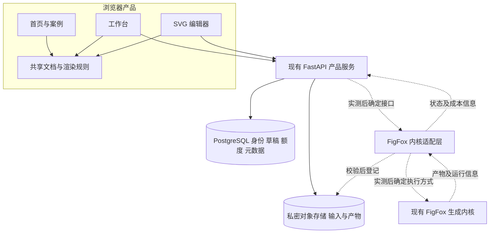

# 学习 DrawAI 后的 FigFox 产品与架构建议

本建议以 2026 年 10 月 3 日的 [DrawAI 网站学习报告](D:/Github_Ku/autodraftman-product/docs/research/drawai-study-2026-10-03.md)、FigFox 当前源代码和本地页面检查为依据。目标是做出能展示、生成并继续编辑科研图的产品，而不只复刻一张研究项目首页。

同日更新：用户指定当前内核为 [LawrenceRiver/FigFox](https://github.com/LawrenceRiver/FigFox)，本地在 `D:/Github_Ku/FigFox-926`；内核建议已按该仓库修订。下文网页现状表记录本次重构前的检查；随后首页已实现独立演示版本，见 [首版设计记录](D:/Github_Ku/autodraftman-product/docs/research/figfox-demo-design-2026-10-03.md)。

建议保留 React、TypeScript、Vite、FastAPI、PostgreSQL、私密对象存储和现有身份系统；重点重构页面职责、SVG 文档模型及生成到编辑的连接。首先用真实案例证明可编辑能力，再根据现有生成内核的实测结果确定执行与进度方案。本文件是架构提案，没有实施生成接口、数据库迁移或执行队列。

## 当前产品已经具备什么

本次查看了首页、工作台和本地 SVG 编辑器入口，同时读取相关前后端实现。实际页面优先于可能过期的说明文档。

| 部分 | 当前确认的情况 | 对后续方案的影响 |
| --- | --- | --- |
| 首页 | 已有创建与重建输入入口，以及带图层切换的原图和编辑结果预览 | 可以沿用入口逻辑；预览还需要增加真实元素交互 |
| 工作台 | 有草稿、输入模式、参考图和输出设置；生成按钮明确提示未开放 | 任务接入应建立在真实内核上，保持界面状态可信 |
| SVG 编辑 | 已集成 SVG-Edit，通过 iframe 消息桥连接产品界面；有本地导入和导出入口 | 可以先复用完整编辑器，验证往返兼容后再决定替换范围 |
| 草稿 | 前后端保存文字或参考图模式，输出格式为 PNG、JPG、WebP | 还没有完整表达重建操作及多种生成产物 |
| 身份和额度 | 账户、游客、OAuth、额度账本等基础已存在 | 应复用，不随页面重构重新建立一套 |
| 图片资源 | 私密对象存储、短期签名上传、图片验证和资源归属 | 参考图路径可复用；SVG 和其他结果需要自己的产物验证 |
| 生成服务 | 当前 API 路由没有生成任务模块；前端按钮仅显示未开放说明 | 还不能宣称有运行、计费、结果保存和重试闭环 |

首页与工作台行为可查 [App.tsx](D:/Github_Ku/autodraftman-product/frontend/src/App.tsx:1492) 和 [生成入口](D:/Github_Ku/autodraftman-product/frontend/src/App.tsx:2847)。API 的现有模块可查 [router.py](D:/Github_Ku/autodraftman-product/backend/src/autodraftman_backend/api/router.py)。草稿约束可查 [前端类型](D:/Github_Ku/autodraftman-product/frontend/src/api.ts:78) 和 [后端草稿模型](D:/Github_Ku/autodraftman-product/backend/src/autodraftman_backend/modules/drafts/models.py:22)。

当前前端 README 仍写首页没有输入框，与本次页面及源代码不符。后续修改需要同步文档。入口 App.tsx 当前为 5077 行，包含页面、文案、路由和多种业务状态；main.tsx 同时载入 tokens、editorial-redesign 和 figfox-redesign 样式。建议建立明确模块边界和统一设计变量，再迁移页面。[入口样式见 main.tsx](D:/Github_Ku/autodraftman-product/frontend/src/main.tsx)。

## 产品应如何组织

建议按用户要完成的事情组织三个主要空间。

| 空间 | 用户要完成的事情 | 主要内容 |
| --- | --- | --- |
| 公开首页与案例 | 理解产品是否适合自己的图，亲手验证可编辑结果 | 短介绍、真实 SVG 案例、原图对照、来源说明、进入工作台 |
| 生成工作台 | 提交需求或原图，跟踪任务，查看和管理结果 | 草稿、上传、任务状态、产物、重试及进入编辑 |
| SVG 编辑器 | 持续修改已经存在的图并导出 | 文字、元素、图层、选择、历史、保存和导出 |

账户、额度和帮助为这些空间提供支持。研究方法与评测可作为独立内容页，首页展示最能解释产品的少量证据。

首页案例建议采用 FigFox 自己的真实输入和输出，默认提供改字、拖动、还原与原图对照。案例应标注测试来源和限制。访客修改的是当前浏览器中的案例副本，不应改变公共案例文件，也不应计费。

工作台继续容纳“从想法创建”和“将现有图重建为可编辑图”两个方向。两种操作可以共享身份、草稿和产物系统，但输入要求与评价标准不同，需要独立表达。首页优先通过位图到 SVG 的案例解释最容易直接验证的能力。

## 推荐的技术结构

下面是建议的职责划分。生成适配层及其执行方式属于待验证部分，不代表当前已经存在这些服务。

### 前端基础继续使用 React 和 Vite

现有栈能够支持这三类空间。DrawAI 的公开案例交互也主要依赖 SVG DOM 和浏览器事件，没有证据说明类似体验必须切换到新的全栈框架。

建议引入明确的页面路由和布局层，逐步从 App.tsx 迁出首页、案例、工作台、编辑器、账户及中英文内容。编辑器按需加载，避免让首次访问首页的访客下载整个 SVG 编辑环境。React Router 的嵌套路由可以组织公共页面和应用布局。[官方路由文档](https://reactrouter.com/start/declarative/routing)。

前端可以按 `pages`、`features`、`shared`、`content` 组织。案例交互放在案例模块，任务请求和状态放在工作台模块，SVG-Edit 消息桥放在编辑模块，身份及通用 API 逻辑集中维护。这是迁移方向，目录命名可随当前工程约定调整。

状态需要分别管理：

- 界面状态包括选中元素、缩放、工具、临时拖动和面板，通常不需要持久保存。
- 文档状态包括 SVG 内容、当前编辑版本和保存状态，应由文档模块负责。
- 服务端状态包括账户、草稿、运行状态和产物列表，应由 API 数据层负责。

这样可以避免每次鼠标移动都触发整个工作台更新，也避免请求结果与编辑器内部状态互相覆盖。暂时不必为了重构同时引入多种状态管理库。

### 首页案例用轻量 SVG 交互

建议直接渲染经过校验的案例 SVG，实现选择、Pointer Events 拖动、文字输入框、原图覆盖、适应视图和重置。坐标换算采用 SVG 矩阵，而不是根据某个案例手工写坐标。

案例清单至少记录原图、SVG、缩略图、viewBox、可编辑标记、来源、生成版本、操作提示和已知限制。清单是演示内容，不是伪造的生成任务响应。

对于复杂 SVG，不应承诺所有可见内容都能以同一种方式编辑。内嵌图片、裁剪、变换、文字路径、分组和字体各有不同含义。可以选择少量确实可操作的对象进行教学，但需要保留完整图并公开说明边界。

### 完整编辑器先复用 SVG-Edit

FigFox 已有 [SvgEditHost](D:/Github_Ku/autodraftman-product/frontend/src/components/editor/SvgEditHost.tsx)，无需因为首页案例只用了轻量编辑，就丢弃完整编辑器。

建议在文档模块与 SVG-Edit 之间增加明确的适配边界：打开某个文档版本、获取修改后的 SVG、记录修改与保存状态、导出、通知错误。首页演示与编辑器都应读取同一份文档内容和资产规则，而不是各自产生看起来相似的图。

是否更换编辑引擎，应通过代表性文件验证决定。至少检查文字、变换、分组、连接线、裁剪、内嵌资源、字体和元素标识能否在导入、修改、再导出后保持。当前已有编辑入口不等于这些往返能力全部验证通过。

如果以后需要语义连接线自动跟随、参数化布局或多人协作，需要额外的文档语义和操作模型，单纯替换画布库不足以实现。

### 后端继续承担身份和产品数据

现有 FastAPI、SQLAlchemy、PostgreSQL 和 Alembic 适合继续管理归属、草稿、额度、资源和文档元数据。生成内核保留其当前 Python 与本地工具链，通过适配层接入产品服务。

按用户最新指定，权威内核位于 [FigFox-926](D:/Github_Ku/FigFox-926/README.md)，远程为 LawrenceRiver/FigFox。当前链路先由 SAM 提供 picture/icon/arrow 裁块，再构建 SVG、准备 1/2 Crop 对照、列问题、按问题执行修复，并按回执开启有次数上限的后续处理。README 所画的整页漂移重跑分支尚未接入代码。本次读取了现有产物与元数据，没有重新运行生成，也没有据此验证在线服务的耗时、费用或可靠性。

适配层需要把产品输入转为内核实际接受的输入，并把运行信息和文件转换成可校验的产物记录。接口应来自内核实测，而不是根据参考网站臆造。

### 执行与进度方案由实测决定

仓库 [repository-policy.md](D:/Github_Ku/autodraftman-product/docs/repository-policy.md:28) 要求先测量生成内核，再增加队列实现、模拟生成契约或 GPU 执行假设。本建议遵循这个顺序。

先确认内核是否阻塞、是否需要子进程、一次任务的资源占用、并发约束和取消行为，再决定是否引入独立执行进程及持久化调度。即使需要分离执行，也可以先采用最小可靠方案，依据负载与恢复要求再选择队列产品。

普通 HTTP API 适合提交操作与读取结果。最初可以用可调间隔的轮询获取状态。若后续需要连续阶段更新，SSE 适合服务端向浏览器单向推送；事件序号、断线重放和权限仍需由我们实现。双向协作成为实际需求后再考虑 WebSocket。[SSE 机制见 MDN](https://developer.mozilla.org/en-US/docs/Web/API/Server-sent_events/Using_server-sent_events)。

生成中的百分比需要有真实可计算依据；只有阶段信息时，应显示阶段和耗时。FastAPI 文档也区分简单后台工作与需要独立执行设施的重任务。[FastAPI Background Tasks 文档](https://fastapi.tiangolo.com/tutorial/background-tasks/)。

## 草稿运行与文档需要分开

以下是候选领域模型，用来明确职责；字段和状态机仍需根据内核及编辑器验证，不是已定稿的生成 API。

| 对象 | 建议承担的职责 | 需要避免的混用 |
| --- | --- | --- |
| Draft | 保存用户尚未提交或可再次修改的输入、操作和参数 | 草稿不表示生成已运行 |
| InputAsset | 记录上传输入、归属、校验和存储位置 | 输入图片不应被生成结果覆盖 |
| Run 与 Attempt | 一次执行及重试尝试、状态、时间和成本 | 重试不能把失败记录直接抹掉 |
| StageEvent | 可复查的阶段变化或运行事件 | 进度动画不能替代真实事件 |
| Artifact | 原始 SVG、预览、报告、可选导出文件等产物 | 一个 PNG 枚举无法代表整个结果包 |
| Document 与 Revision | 用户能够持续编辑的图及版本 | 用户改图不应重写不可变的模型原始输出 |
| PublishedCase | 用户明确公开或团队策划的案例及来源 | 私密任务不会因为已有展示页面而自动公开 |

现有 UI 的 create 与 rebuild 是临时状态，而持久化草稿只有 text 与 reference 模式。未来需要分别表达“执行什么操作”和“输入来自哪里”。旧的参考图草稿可能是参考图创作，不能全部自动判为重建；迁移要保留原意，并在实际执行前确定操作。

建议把可编辑 SVG 作为核心产物，预览图作为便于查看的衍生产物。PNG、JPG、WebP 可以继续作为导出或预览选项。PPTX、PDF、批量文件包等只有通过真实转换与兼容性验证后才进入产品承诺。

每项产物应能够关联原始输入、内核版本和执行尝试。若需要对 SVG 进行规范化或补充编辑标记，保存原始输出，并另存派生版本及转换记录。这也有助于区分系统重建质量与用户后续修改。

## 接入内核前需要测清楚什么

下面的测量表是确定架构的依据，尚未填写的部分不能用参考网站行为代替。

| 契约部分 | 必须得到的实际信息 | 影响的产品决策 |
| --- | --- | --- |
| 输入 | 接受的图片、文字、尺寸、参考资产、路径和参数 | 上传约束及工作台表单 |
| 运行 | 启动方式、隔离目录、超时、退出码、日志与阶段信息 | 执行适配、状态显示与错误提示 |
| 耗时与资源 | 单图时间分布、内存、并发、外部 API 和成本 | 并发上限、等待体验及额度策略 |
| 输出 | SVG、预览、资源、报告、字体、几何与标识 | 文档模型、预览及编辑器兼容 |
| 恢复 | 失败清理、取消、重复请求、重试和进程重启行为 | 幂等、成本约束及失败恢复 |
| 编辑往返 | 输入编辑器前后的结构、资源与渲染变化 | 是否可复用现有编辑器 |

建议先用少量有代表性的输入建立契约，覆盖文字、连接线、分组和内嵌图片等问题。方法范围以 FigFox-926 当前实现为准；既不沿用已经被用户更新的旧 August 包假设，也不根据 DrawAI 的展示推断我们已经具备其他功能。

本次学习没有进行付费生成。后续实验需要遵循项目已有预算和评价规则，开发样本与冻结后的验证样本分开。

## 存储编辑与额度怎样连接

### 输入与产物采用不同验证

现有上传配置和 Pillow 验证针对 PNG、JPEG、WebP。[配置](D:/Github_Ku/autodraftman-product/backend/src/autodraftman_backend/core/config.py:50) 与 [图片验证](D:/Github_Ku/autodraftman-product/backend/src/autodraftman_backend/modules/assets/storage.py:53) 可以继续保护参考图路径。

SVG 需要解析和内容检查；其他导出格式也需要自己的大小、格式和下载策略。因此应将结果产物作为独立处理路径，而不是把 SVG 强行送进当前图片验证器。

私密文件继续使用对象存储键和短期授权访问，权限由后端验证。浏览器拿到某个任务标识，不代表拥有它的产物或修改权。预览缓存、导出和删除都需要沿用同样的归属规则。

### 保留现有 SVG 内容清理

公开案例中的 SVG 是站点自己提供的资源，DrawAI 可以针对这组文件使用直接 DOM 操作。FigFox 接受用户 SVG 时仍需要内容清理。

当前 [svgDocument.ts](D:/Github_Ku/autodraftman-product/frontend/src/svgDocument.ts:1) 已使用 DOMPurify，限制为 5 MB 和 12000 个元素，并处理危险标签和外部引用。应保留这些保护，通过受控资产解析支持必要资源，不因演示交互而放开任意脚本和外部访问。

生成结果的预览与编辑也需要一致的字体、viewBox、资源路径和文字处理。若后台预览与浏览器使用不同渲染环境，要测试并记录差异。

### 额度跟随真实运行事件

现有额度模型包含可用余额、预留余额和事务幂等约束，但当前没有已经接通的生成扣费流程。[额度模型](D:/Github_Ku/autodraftman-product/backend/src/autodraftman_backend/modules/credits/models.py:24)。

建议在内核费用口径确定后，将提交、预留、结算和失败释放连接到真实运行事件。同一次请求、回调或重试的重复处理不能重复扣费，取消或进程中断也应有明确规则。页面演示不创建费用事务。

### 文档保存需要版本与兼容迁移

现有本地草稿缓存保存最多 30 条，并使用已有存储键。[drafts.ts](D:/Github_Ku/autodraftman-product/frontend/src/drafts.ts:3)。重构时应提供兼容读取和迁移，避免仅因更换名字而让旧草稿消失。

文档保存应能区分本地修改、保存进行中、保存成功和冲突。对于跨标签或跨设备修改，需要版本校验，避免旧页面覆盖新版本。数据库模式变更按仓库要求通过 Alembic 迁移。

## 部署边界

公开首页、公开案例元数据和静态前端可以通过现有静态部署方式发布；账户、私密任务、编辑版本与文件授权由后端提供。公开部署镜像继续作为镜像，不成为第二套功能开发仓库。

API、PostgreSQL 和对象存储继续作为产品基础。是否把内核放入独立服务或进程，等待测量结果。初期没有依据要求 Kubernetes、GPU 服务集群或多层消息系统。

若搜索引擎收录研究内容成为实际需求，可以为公开页面增加预渲染或其他针对性方案。完整应用不必为了静态首页的搜索需求一起改换框架。

## 推荐的实施顺序

### 先把真实案例做成可操作页面

从当前首页抽出案例展示模块，接入一套具备来源和限制说明的真实 FigFox SVG。完成改字、拖动、对照、恢复，以及桌面手机和中英文适配。清楚区分案例体验和在线任务。

完成标准是访客可以操作真实元素，而且同一份 SVG 能在完整编辑器中打开；图层预览不会冒充元素编辑。

### 同时测量内核并确定文档边界

用小批代表性输入记录输入、产物、耗时、成本和失败方式，测试 SVG 与现有编辑器的往返兼容。基于这些证据确定产物及文档模型，再迁移草稿和拆分页面。

完成标准是接口约束来自实际内核，现有草稿可恢复，原始输出与用户编辑版本能明确区分。

### 接通一次任务的完整路径

先实现一张图从提交、运行、产物登记到打开编辑器、保存和导出的完整流程。包含至少一个失败场景，检查重复提交、取消、页面刷新和权限。

完成标准是用户能得到真实 SVG，继续修改并导出；错误和费用都来自真实状态。执行与进度实现的选择在这一步依据测量确定。

### 再扩展可靠性和能力

根据实际任务负载增加并发与恢复能力，随后考虑批量、更多导出格式和更丰富的评测。只有完成相应验证，才把能力写入首页和产品说明。

完成标准是结果、时间、成本和限制均可复查，公开案例与私密任务使用各自明确的发布规则。

## 当前应该保留和重构的部分

| 部分 | 建议 |
| --- | --- |
| 身份 OAuth 私密上传 额度账本 | 保留已有基础，根据任务接入需要增补 |
| React TypeScript Vite FastAPI PostgreSQL | 继续使用，现有基础能够承载目标体验 |
| SVG-Edit | 先通过适配边界复用，并进行代表性往返验证 |
| App.tsx 中的页面 路由 文案 业务状态 | 分模块迁移，减少互相影响 |
| 首页预览 | 改为真实可操作案例，增加来源和能力边界 |
| 草稿输出和结果表达 | 重构为操作 输入 运行 产物 文档版本 |
| 设计变量和样式 | 合并职责，建立统一组件和双语布局规则 |
| 执行队列 推送方式 新导出格式 | 实测后决定，不提前绑定实现 |

本次只新增研究文档，未修改产品页面、业务服务、数据库或研究内核。后续最有价值的具体工作是验证一份真实 SVG 如何从首页案例进入完整编辑器，同时测清现有内核的输入与产物契约。
